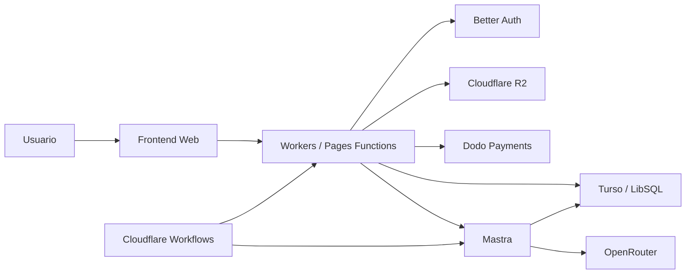

# 4. Vista de contexto

```mermaid
flowchart LR
    U[Usuario] --> FE[Frontend Web]
    FE --> API[Workers / Pages Functions]
    API --> AUTH[Better Auth]
    API --> DB[Turso / LibSQL]
    API --> R2[Cloudflare R2]
    API --> BILL[Dodo Payments]
    API --> MAS[Mastra]
    MAS --> OR[OpenRouter]
    MAS --> DB
    WF[Cloudflare Workflows] --> API
    WF --> MAS
```
