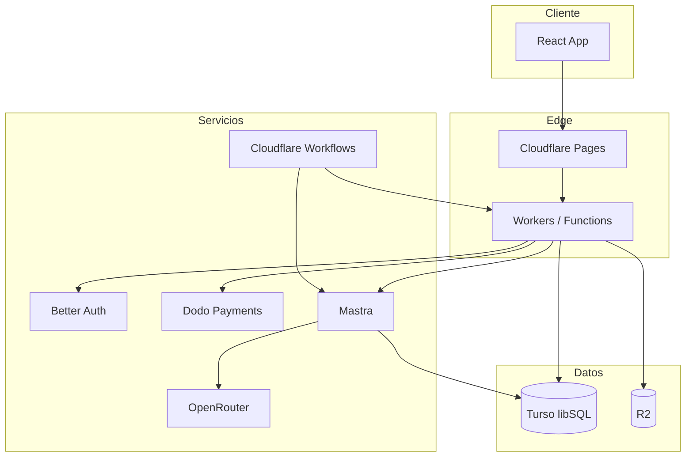

# 5. Vista de contenedores

```mermaid
flowchart TB
    subgraph Cliente
        UI[React App]
    end

    subgraph Edge
        CFP[Cloudflare Pages]
        BFF[Workers / Functions]
    end

    subgraph Datos
        TURSO[(Turso libSQL)]
        R2[(R2)]
    end

    subgraph Servicios
        BA[Better Auth]
        DP[Dodo Payments]
        MAS[Mastra]
        OR[OpenRouter]
        WF[Cloudflare Workflows]
    end

    UI --> CFP
    CFP --> BFF
    BFF --> BA
    BFF --> DP
    BFF --> TURSO
    BFF --> R2
    BFF --> MAS
    MAS --> OR
    MAS --> TURSO
    WF --> BFF
    WF --> MAS
```
