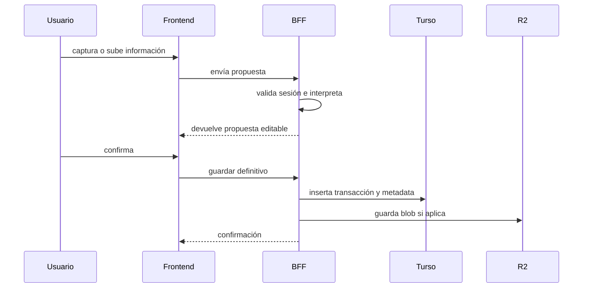
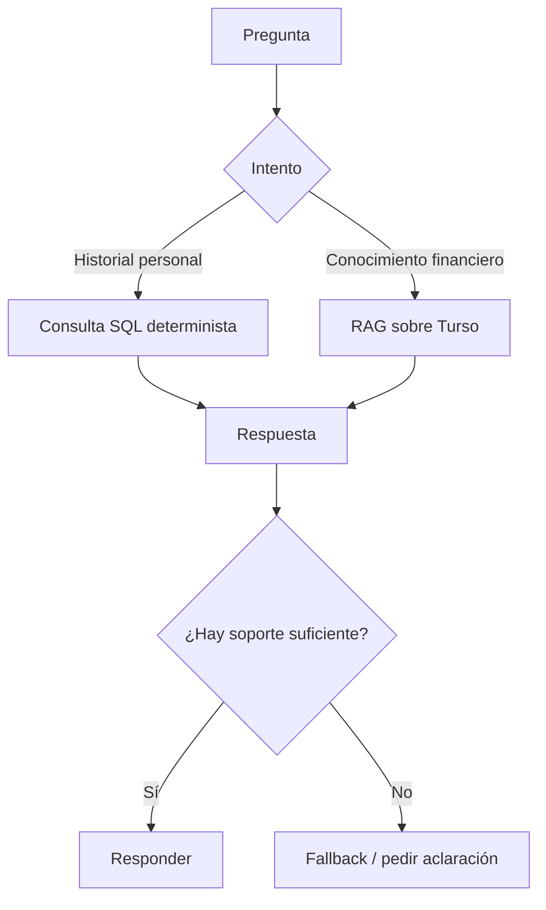

# 9. Flujos de integración

## 9.1 Registro manual o asistido

```mermaid
sequenceDiagram
    participant U as Usuario
    participant FE as Frontend
    participant API as BFF
    participant DB as Turso
    participant R2 as R2

    U->>FE: captura o sube información
    FE->>API: envía propuesta
    API->>API: valida sesión e interpreta
    API-->>FE: devuelve propuesta editable
    U->>FE: confirma
    FE->>API: guardar definitivo
    API->>DB: inserta transacción y metadata
    API->>R2: guarda blob si aplica
    API-->>FE: confirmación
```

## 9.2 Pregunta al chatbot

```mermaid
flowchart TD
    Q[Pregunta] --> I{Intento}
    I -->|Historial personal| D[Consulta SQL determinista]
    I -->|Conocimiento financiero| R[RAG sobre Turso]
    D --> A[Respuesta]
    R --> A
    A --> V{¿Hay soporte suficiente?}
    V -->|Sí| O[Responder]
    V -->|No| F[Fallback / pedir aclaración]
```
